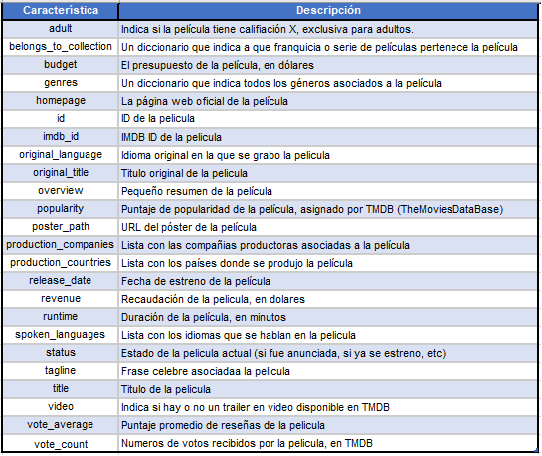
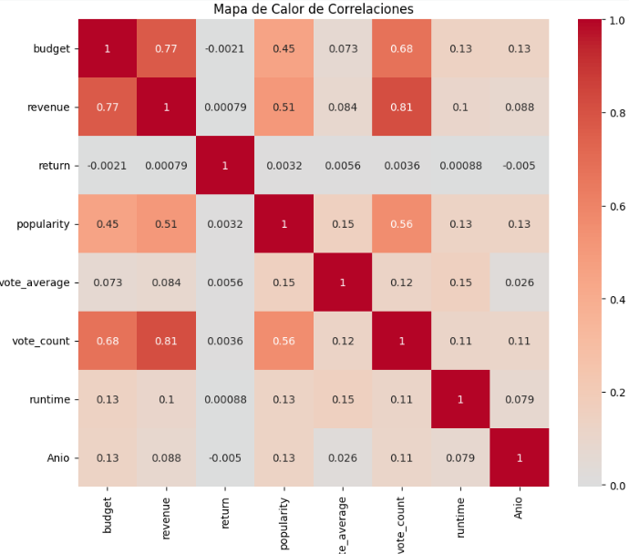

# <h1 align=center>**`Machine Learning (MLOps)`**</h1>

<h1 align="center">
  @autor: Lesmen Gerardo García Pernia  
  <a href="https://github.com/lesmengp/PI_ML_OPS.git">GitHub: https://github.com/lesmengp/PI_ML_OPS.git</a>  
  <a href="https://drive.google.com/drive/folders/1c1wGdo7MV3T0YunNszSdCpvz-mNldwBw?usp=drive_link">Drive: https://drive.google.com/drive/folders/1c1wGdo7MV3T0YunNszSdCpvz-mNldwBw?usp=drive_link</a>  
  <a href="https://pi-ml-ops-srp.onrender.com">Render: https://pi-ml-ops-srp.onrender.com</a>
</h1>

# <h1 align=center> ***Construir un Modelo de ML para Recomendaciones de Películas*** </h1>

# <h1 align=center> **`PROYECTO INDIVIDUAL Nº1`** </h1>

## Objetivos:
### *Crear un Modelo de Sistema de Recomendacion utilizando las caracteristicas de las películas para encontrar peliculas similares a las que ha visto un determinado usuario y le han gustado.*

### En el presente proyecto estará utilizando un modelo de Recomendacion Basado en el Analisis de Contenido. El objetivo de este tipo de modelo es analizar y seleccionar desde una gran Base de Datos, productos que sean similares a las caracteristicas de preferencia de un usuario. *"Seleccionar productos similares a aquellos que te gustan"*   Adicionalmente, estaremos utilizando como medida para cuantificar la similitud entre las películas, *`la Similitud del Coseno`*.   La Similitud del Coseno mide el coseno del ángulo entre dos vectores en un espacio vectorial y mientras más pequeño sea el ángulo entre los vectores, más similares se consideran.    La fórmula para calcular la similitud del coseno entre dos vectores A y B se define de la siguiente manera:La fórmula de la similitud del coseno es:

$$ \frac{A \cdot B}{\|A\| \cdot \|B\|} $$

Donde:
- \( A \cdot B \) es el producto escalar entre los vectores \( A \) y \( B \).
- \( \|A\| \) es la norma euclidiana del vector \( A \).
- \( \|B\| \) es la norma euclidiana del vector \( B \).

La similitud del coseno varía entre -1 y 1, donde: Si la similitud del coseno es 1, los vectores son idénticos. Si la similitud del coseno es 0, los vectores son completamente ortogonales (no tienen similitud). Si la similitud del coseno es -1, los vectores son opuestos (tienen similitud negativa).

Para mayor información, podrias visitar estas páginas: 
https://www.futurespace.es/sistemas-de-recomendacion-de-contenidos-adivina-que-piensan-tus-clientes/

https://learn.microsoft.com/es-es/azure/architecture/solution-ideas/articles/build-content-based-recommendation-system-using-recommender

# Inicio del Proyecto!!!

### Librerias Utilizadas: 
fastapi==0.93.0 
pandas==1.3.5 
pip==23.2.1 
typing-extensions==4.5.0 
uvicorn==0.20.0 
scikit-learn==1.0.2 
regex==2023.5.5 
sklearn==0.0.post5 
matplotlib==3.7.1 
seaborn=0.12.2 
numpy=1.24.3 

Puntos a Desarrollar:
1) Extracción Transformación y Carga (ETL)
2) Analisis Exploratorios de los Datos (EDA)
3) Guardando el DataSets resultante para luego subirlo a GitHub.
4) Funciones APis

# 1) Extracción Transformación y Carga (ETL)
## **Fuente de datos:**

+ [Dataset](https://drive.google.com/drive/folders/1mfUVyP3jS-UMdKHERknkQ4gaCRCO2e1v): Carpeta con los 2 archivos con datos que requieren ser procesados (movies_dataset.csv y credits.csv), tengan en cuenta que hay datos que estan anidados (un diccionario o una lista como valores en la fila).
+ [Diccionario de datos](https://docs.google.com/spreadsheets/d/1QkHH5er-74Bpk122tJxy_0D49pJMIwKLurByOfmxzho/edit#gid=0): Diccionario con algunas descripciones de las columnas disponibles en el dataset.
 

Diccionario de Datos del Proyecto

### 1.1) Revision inicial de los datos de "df_movies"
Total de Registros del DataSets de df_movies =  45466 
Total de Columnas del DataSets de df_movies =  24 

Total de Registros del DataSets de df_credits =  45476 
Total de Columnas del DataSets de df_credits =  3 

Total de valores nulos en 'df_movies'=  105562

### 1.1.1) Requerimientos Iniciales del Proyecto:
### 1.1.1.1) Requerimiento del Proyecto, Nro.: 1
+ Algunos campos, como **`belongs_to_collection`**, **`production_companies`** y otros (ver diccionario de datos) están anidados, esto es o bien tienen un diccionario o una lista como valores en cada fila, ¡deberán desanidarlos para poder  y unirlos al dataset de nuevo hacer alguna de las consultas de la API! O bien buscar la manera de acceder a esos datos sin desanidarlos.

Se Visualiza que las siguientes columnas estan anidadas:

<ul>
<li> 1) belongs_to_collection (Diccionario).</li>
<li> 2) genres (Lista de Diccionario). </li>
<li> 3) production_companies (Lista de Diccionario).</li>
<li> 4) production_countries (Lista de Diccionario).</li>
<li> 5) spoken_languages (Lista de Diccionario).</li>
</ul>

Se procede a crear dos Funciones para Desanidar estas 5 columnas anidadas. La primera función ***(`Extraer_Valor_Dicc`)***, para extraer de la columna 'belongs_to_collection' sus campos en forma de diccionarios. Y la segunda función ***(`Extraer_Valor_List`)***, para extraer del resto de las columnas que contienen sus campos como una lista de diccionarios.

### 1.1.1.2) Requerimiento del Proyecto, Nro. 2
+ Los valores nulos de los campos **`revenue`**, **`budget`** deben ser rellenados por el número **`0`**.

Inicialmente la cantidad de nulos son los siguientes: 
Cantidad de Valores Nulos de 'revenue': 6  
Cantidad de Valores Nulos de 'budget': 0  

Pero al pasar la columna 'budget' de tipo objeto a númerica, aparecen 3 valores nulos; los cuales también son eliminados.

### 1.1.1.3) Requerimiento del Proyecto, Nro. 3
+ Los valores nulos del campo **`release_date`** deben eliminarse.

Se procede a eliminar 87 vlores nulos de la columna 'release_date'

### 1.1.1.4) Requerimiento del Proyecto Nro. 4
+ De haber fechas, deberán tener el formato **`AAAA-mm-dd`**, además deberán crear la columna **`release_year`** donde extraerán el año de la fecha de estreno.

 Cuando realizamos el cambio del tipo de dato a fecha, aparecen 3 valos nulos; los cuales son eliminados. Luego se crea la columna nueva, solo con el año.

### 1.1.1.5) Requerimiento del Proyecto, Nro. 5
+ Crear la columna con el retorno de inversión, llamada **`return`** con los campos **`revenue`** y **`budget`**, dividiendo estas dos últimas **`revenue / budget`**, cuando no hay datos disponibles para calcularlo, deberá tomar el valor **`0`**.

Se crea la columna con la formula del retorno de inversión, tomando en cuenta que pueden haber divisiones por cero; el cual podría generar errores.

### 1.1.1.6) Requerimiento del Proyecto, Nro. 6
+ Eliminar las siguientes 6 columnas que no serán utilizadas, **`video`**,**`imdb_id`**,**`adult`**,**`original_title`**,**`poster_path`** y **`homepage`**.

Se proce a elimiar las columnas rqueridas.

## 1.2) Revision inicial de los datos de "df_credits"
### 1.2.1) Visualizando la primera columna: ***`cast`***

Esta columna cast describe información sobre el reparto de una película.  
Cada registro en el DataFrame representa un miembro del reparto de la película y contiene la siguiente información:

+ "cast_id": El ID del reparto al que pertenece el actor o actriz.
+ "character": El personaje que el actor o actriz interpreta en la película.
+ "credit_id": El ID del crédito en la base de datos de la película.
+ "gender": El género del actor o actriz (1 para mujeres, 2 para hombres).
+ "id": El ID del actor o actriz en la base de datos de la película.
+ "name": El nombre del actor o actriz. 
+ "order": El orden en el que aparece el actor o actriz en los créditos de la película.
+ "profile_path": La ruta de acceso al perfil del actor o actriz en la base de datos de la película.  

### 1.2.2) Visualizando la primera columna: ***`crew`***

La columna "crew" contiene información sobre el equipo de producción de una película.  

Cada registro en el DataFrame contiene la siguiente información:

+   "credit_id": El ID del crédito en la base de datos de la película.
+   "department": El departamento en el que trabaja el miembro del equipo de producción (por ejemplo, dirección, guion, diseño de producción, fotografía, etc.).
+    "gender": El género del miembro del equipo de producción (1 para mujeres, 2 para hombres).
+   "id": El ID del miembro del equipo de producción en la base de datos de la película.
+   "job": El trabajo que realiza el miembro del equipo de producción (por ejemplo, director, guionista, diseñador de producción, director de fotografía, etc.).
+   "name": El nombre del miembro del equipo de producción.
+   "profile_path": La ruta de acceso al perfil del miembro del equipo de producción en la base de datos de la película.

### 1.2.3) Función para Desanidar las Columnas: ***`'cast'`*** y ***`'crew'`*** 

Se crea una función para desanidar las dos columnas del dataframe 'df_credits': `Extraer_Valor_List_Credits`

### 1.2.3.1) Desanidando la Columna:  ***`cast`***
### 1.2.3.2) Desanidando la Columna:  ***`crew`***
## 1.3) Eliminación Registros Duplicados de los Datasets df_credits y 'df_movies'.
Se procede a eliminar los registros duplicados en ambos dataframe: 
Total de Registros Duplicados en: 'df_movies' =  30 
Total de Registros Duplicados en: 'df_credits' =  44 

# 2) Analisis Exploratorios de los Datos (EDA)

## 2.1) Preprocesamiento de Datos:
### 2.1.1) Valores Faltantes
En resumen, el total de valores faltantes es el siguiente: 
Total de valores nulos en 'df_movies'=  67098 
Total de valores nulos en 'df_credits'=  0 

### Analisís de cada columnas con valores faltantes: 

1) Columna = 'original_language' 
En resumen en la columna 'original_language' tiene el 0,024 % de valores nulos.
En el 70.992 % de los casos, el Idioma predominante es Ingles ('en'). 
Por lo tanto se decide imputar los 11 valores nulos con el idioma que tiene la mayor frecuencia = 'en'.

2) Columna = 'overview' 
La información de la columna 'overview' es relevante ya que nos ofrece una caracteristica general de la película. No tener este atributo impacta en la recomendación de la película, en el caso de utilizar esta columna para la dicha recomendación. En resumen, en este momento no es oprtuno eliminar estos valores NaN. Total de valores nulos 941.  (2.075 %)  

3) Columna = 'runtime' 
En este caso, se procede a imputar con el valor del Cuartil Q3 (107); ya que indica que el 75 % de la duración de la película dura aproximadamente 107 minutos o menos.  En resumen, se procede a sustituir los 246 valores nulos de la columna 'runtime' por 107 (Tiempo en minutos) ya que la diferencia entre el Q3 y la media (13), es mucho menor que la desviación estandar; qué es la que nos indica la dispersión de los datos.  Estos 246 valores quedarian a menos de una desviación estandar de la media.

4) Columna = 'status' 
Se puede observar que hay 80 películas (0.176 %) de un total de 45376 con valores nulos en el columa de 'status'. Es de notar que el 99.205 % de todas las peliculas estan con estatus de 'Release' (Estrenadas).  Es muy probable que para la fecha actual, ya estas películas también esten estrenadas.  Adicionalmente, si una película no ha sido estrenada hasta la fecha actual, entonces el usuario no podrá sugerirla como que le gustó; ya que no ha visto todavía. En este sentido, el Sistema de Recomendación estaría sólo esperando que la vea.  Por tales razones, se procede a imputar este campo por el atributo 'Released'. Cabe destacar, que el error por lo imputación es muy pequeño y que adicionalmente, tiende a disminuir, dado que es solo de tiempo.

5) Columna = 'tagline' 
Esta columna representa menos de la mitad de datos válidos del Dataset. El 55.04 % de esta columna son datos faltantes, en este caso datos nulos.   Se procede a eliminar esta columna 'tagline'

6) Columna = 'Franquicia' 
Se puede observar que la Columna 'Franquicia' tiene el 90.109 % de valores faltantes. Sin embargo, no se procede tomar ninguna acción ya que es una columna clave para responder la consulta de la función Nro.3.

### 2.1.2) Valores Atípicos

En las graficas de Cajas o Bogites se puede observar que practicamente todas las variables presentan datos atipicos. Las variables con menos datos atípicos son el voto promedio y la popularidad de las películas.

Adicionalmente, se realizó una correlación entre las variables númericas y solo se encontro una correlación significativa del 0,81, entre las variables 'vote_count' y 'revenue'.

Preguntas a tomar en consideración:

1) Una película con una alta popularidad, deberia ser recomendada?   
2) Una película con una alta popularida, deberia tener un mayor vote_average?. Deberían ser directamente proporcionales?. (Su correlación tan solo es del 0.15. No existe ninguna relación.)  

### 2.1.3) Escalado / Normalizado

Dado que estamos utilizando la Similitud del Coseno, como medida de similitud para hacer la recomendación de las películas, es poco probable realizar algun tipo de escalado y/o normalización de variables.    La similitud del coseno ya tiene en cuenta la magnitud de las variables y se enfoca en la dirección relativa entre los vectores de características.

Dado que la similitud del coseno se basa en el ángulo entre los vectores y no en la magnitud absoluta; no deberíamos tener problemas de escala que afecten considerablemente a los resultados de la recomendación de la película.

### 2.1.4) Codificación de Variables

La similitud del coseno realiza sus operaciones con vectores numéricos y no requiere una codificación explícita de variables categóricas.

La similitud del coseno calcula la similitud entre dos vectores númericos basándose en el ángulo entre ellos en un espacio n-dimensional. No asigna un valor numérico a las categorías en sí, por lo que no es necesario convertir variables categóricas en variables numéricas codificadas.

### 2.1.5) Seleccion de atributos
+   2.1.5.1) Eliminación de Columnas del Datasets: 'df_movies	
+   2.1.5.2) Selecion de Actores desde el Datasets: 'df_credits', para la recomendacion.
+   2.1.5.3) Selecion del Director desde el Datasets: 'df_credits', para la recomendacion.
+   2.1.5.4) Unión de ambos Datasets df_credits y 'df_movies', para realizar mejor manipulacion de las variables.
+   2.1.5.5) Selección de Variables para la Recomendación de Películas.

### Columnas Selecionadas para la Recomendación
+   'Generos' 
+   'Director'
+   'Protagonista'
+   'Actor1'
+   'Actor2'
+   'popularity'
+   'Anio'
+   'vote_average'
+   'Franquicia'

### 2.1.6) Ingeniería de Features

Dado que el cálculo de similitud se basa en las características presentes en los datos y no en una representación numérica específica de ellas, no es necesario realizar transformaciones complejas o ingeniería de características en el sentido tradicional. Las características originales, ya sean cuantitativas o incluso cualitativas, se utilizan directamente en el cálculo de similitud del coseno.

La similitud del coseno opera en el espacio de características original sin requerir codificaciones específicas ni combinaciones de características.

En nuestro caso, la selección de las características relevantes es el factor primordial para nuestra recomendación. Y adicionalmente, en la calidad de los datos que tengamos

# 3) Guardando el DataSets resultante para luego subirlo a GitHub.	

Los datos resultantes del ETL, EDA y requerimientos del proyecto, se guardan en el siguiente archivo: 
+   df_movies_JOIN.csv

+   df_movies_JOIN.to_csv('DataSets/df_movies_JOIN.csv', sep=',')

# 4) Funciones APis

En el código de cada función se realizó la documentacón respectiva del funcionamiento de la misma. 

Los requerimientos de las funciones a desarrollar son los siguiente:

### 4.1) Funciones Requeridas

+ def **peliculas_idioma( *`Idioma`: str* )**:
    Se ingresa un idioma (como están escritos en el dataset, no hay que traducirlos!). Debe devolver la cantidad de películas producidas en ese idioma.

&nbsp;&nbsp;&nbsp;&nbsp;&nbsp;&nbsp;&nbsp;&nbsp;&nbsp;&nbsp;&nbsp;&nbsp;&nbsp;&nbsp;&nbsp;&nbsp;&nbsp;&nbsp;&nbsp;&nbsp;Ejemplo de retorno: *`X` cantidad de películas fueron estrenadas en `idioma`*
         

+ def **peliculas_duracion( *`Pelicula`: str* )**:
    Se ingresa una pelicula. Debe devolver la duracion y el año.

&nbsp;&nbsp;&nbsp;&nbsp;&nbsp;&nbsp;&nbsp;&nbsp;&nbsp;&nbsp;&nbsp;&nbsp;&nbsp;&nbsp;&nbsp;&nbsp;&nbsp;&nbsp;&nbsp;&nbsp;Ejemplo de retorno: *`X` . Duración: `x`. Año: `xx`*

+ def **franquicia( *`Franquicia`: str* )**:
    Se ingresa la franquicia, retornando la cantidad de peliculas, ganancia total y promedio
    
&nbsp;&nbsp;&nbsp;&nbsp;&nbsp;&nbsp;&nbsp;&nbsp;&nbsp;&nbsp;&nbsp;&nbsp;&nbsp;&nbsp;&nbsp;&nbsp;&nbsp;&nbsp;&nbsp;&nbsp;Ejemplo de retorno: *La franquicia `X` posee `X` peliculas, una ganancia total de `x` y una ganancia promedio de `xx`*

+ def **peliculas_pais( *`Pais`: str* )**:
    Se ingresa un país (como están escritos en el dataset, no hay que traducirlos!), retornando la cantidad de peliculas producidas en el mismo.
    
&nbsp;&nbsp;&nbsp;&nbsp;&nbsp;&nbsp;&nbsp;&nbsp;&nbsp;&nbsp;&nbsp;&nbsp;&nbsp;&nbsp;&nbsp;&nbsp;&nbsp;&nbsp;&nbsp;&nbsp;Ejemplo de retorno: *Se produjeron `X` películas en el país `X`*

+ def **productoras_exitosas( *`Productora`: str* )**:
    Se ingresa la productora, entregandote el revunue total y la cantidad de peliculas que realizo. 
    
&nbsp;&nbsp;&nbsp;&nbsp;&nbsp;&nbsp;&nbsp;&nbsp;&nbsp;&nbsp;&nbsp;&nbsp;&nbsp;&nbsp;&nbsp;&nbsp;&nbsp;&nbsp;&nbsp;&nbsp;Ejemplo de retorno: *La productora `X` ha tenido un revenue de `x`*

+ def **get_director( *`nombre_director`* )**:
    Se ingresa el nombre de un director que se encuentre dentro de un dataset debiendo devolver el éxito del mismo medido a través del retorno. Además, deberá devolver el nombre de cada película con la fecha de lanzamiento, retorno individual, costo y ganancia de la misma, en formato lista.

 

### 4.2) Función de Recomendación de 5 Películas
+ def **recomendacion( *`titulo`* )**:
    Se ingresa el nombre de una película y te recomienda las similares en una lista de 5 valores.

 

# Fin del Proyecto!!!

  

