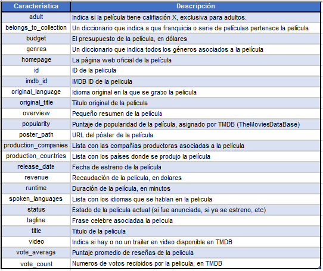

# <h1 align=center> **PROYECTO INDIVIDUAL Nº1** </h1>

# <h1 align=center>**`Modelo de Recomendación de Películas`**</h1>

# <h1 align=center>**`Machine Learning (MLOps)`**</h1>

## **Fuente de datos**

+ [Dataset](https://drive.google.com/drive/folders/1mfUVyP3jS-UMdKHERknkQ4gaCRCO2e1v): Carpeta con los 2 archivos con datos que requieren ser procesados (movies_dataset.csv y credits.csv), tengan en cuenta que hay datos que estan anidados (un diccionario o una lista como valores en la fila).
+ [Diccionario de datos](https://docs.google.com/spreadsheets/d/1QkHH5er-74Bpk122tJxy_0D49pJMIwKLurByOfmxzho/edit#gid=0): Diccionario con algunas descripciones de las columnas disponibles en el dataset.
 

Diccionario de Datos del Proyecto

## **Descripción del problema (Contexto y rol a desarrollar)**

## Contexto

